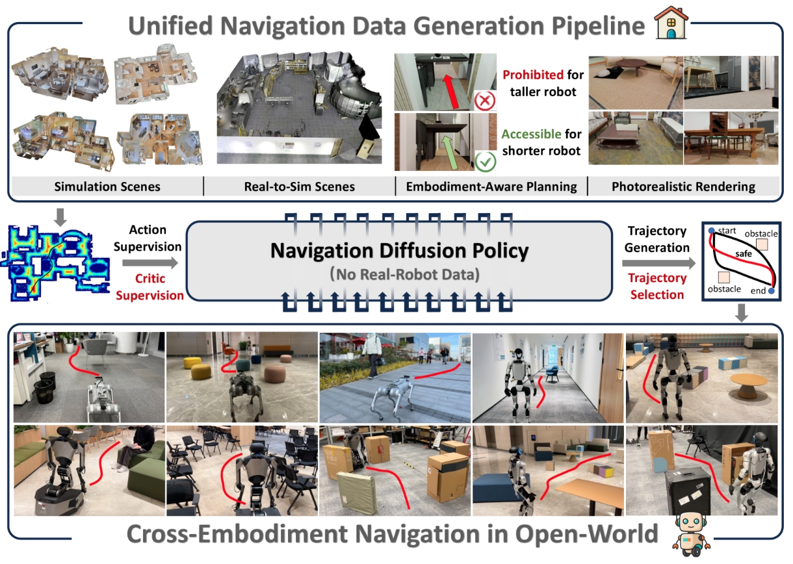

<p align="center">
<h1 align="center"><strong>NavDP: Learning Sim-to-Real Navigation Diffusion Policy with Privileged Information Guidance</strong></h1>
  <p align="center">
    <!--   	<strong>CVPR 2024</strong><br> -->
    <a href='https://wzcai99.github.io/' target='_blank'>Wenzhe Cai</a>&emsp;
	<a href='https://github.com/steinate' target='_blank'>Jiaqi Peng</a>&emsp;
    <a href='https://yuqiang-yang.github.io/' target='_blank'>Yuqiang Yang</a>&emsp;
    <a href='https://github.com/command-z-z' target='_blank'>Yujian Zhang</a>&emsp;
    <a href='https://scholar.google.com.hk/citations?user=Wx8ChLcAAAAJ&hl=zh-CN' target='_blank'>Meng Wei</a>&emsp; <br>
    <a href='https://hanqingwangai.github.io/' target='_blank'>Hanqing Wang</a>&emsp; 
    <a href='https://yilunchen.com/about/' target='_blank'>Yilun Chen</a>&emsp;
    <a href='https://tai-wang.github.io/' target='_blank'>Tai Wang</a>&emsp;
	<a href='https://oceanpang.github.io/' target='_blank'>Jiangmiao Pang</a>&emsp;
    <br>
    Shanghai AI Laboratory&emsp; 
    Tsinghua University&emsp; <br>
    Zhejiang University&emsp;
    The University of Hong Kong&emsp;
    <br>
  </p>
</p>

<div id="top" align="center">

[](https://wzcai99.github.io/navigation-diffusion-policy.github.io/)
[](https://arxiv.org/abs/2505.08712)
[](https://www.youtube.com/watch?v=vfUnxD9WfoA)

</div>

## 🏡 About
Learning navigation in dynamic open-world environments is an important yet challenging skill for robots. Most previous methods rely on precise localization and mapping or learn from expensive real-world demonstrations. In this paper, we propose a novel diffusion policy network that enables zero-shot sim-to-real transfer and can generalize across different robot platform and diverse scenes. Besides, we build a highly efficient navigation data generation pipeline that can support both synthetic scene assets and 3D Gaussian-Splatting assets.
<div style="text-align: center;">
    
</div>

## 🛠️ Installation
Please follow the instructions to config the environment for NavDP.

Step 0: Clone this repository
```bash
git clone https://github.com/wzcai99/NavDP.git
cd NavDP/navdp_api/
```

Step 1: Create conda environment and install the dependency
```bash
conda create -n navdp python=3.10
conda activate navdp
pip install -r requirements.txt
```

## 🤖 Run NavDP Model
Please fill this [form](https://docs.google.com/forms/d/e/1FAIpQLSdl3RvajO5AohwWZL5C0yM-gkSqrNaLGp1OzN9oF24oNLfikw/viewform?usp=dialog) to access the link to download the NavDP model checkpoint. Then, run the following line to start navdp server:
```bash
python navdp_server.py --port ${YOUR_PORT} --checkpoint ${SAVE_PTH_PATH}
```
By querying with RGB-D observations, the navdp server will return the prediction trajectories as well as the critic values. We provide 2 examlpes of RGB-D observation clips, you can download via the following link: 
[example-A-RGB](https://drive.google.com/file/d/1-sJ3N__mDb4qUkOv_zmpuRKSBMAbLhb5/view?usp=drive_link), [example-A-Depth](https://drive.google.com/file/d/1jVbDONzP5_M56QmaLW4HCqTCXGFMDQbO/view?usp=drive_link), [example-B-RGB](https://drive.google.com/file/d/1qwY-G3qS7A9hUh3pr_W6A5aEUpywPTSf/view?usp=drive_link), [example-B-Depth](https://drive.google.com/file/d/1oE4QCdl7hvBMs-5079ErdILskmTOAE1M/view?usp=drive_link).

And we provide an example code to run the inference results with visualization. 
```bash
python navdp_client.py --port ${YOUR_PORT}  -rgb_pkl ${SAVED_RGB_PKL} --depth_pkl ${SAVED_DEPTH_PKL} --output_path ${EXPECT_OUTPUT_PATH}
```

## 📝 TODO List
- \[x\] Release the arXiv paper in May, 2025.
- \[x\] Release the scripts and checkpoint for deployment.
- \[ \] Release the large-scale navigation dataset.
- \[ \] Release the evaluation benchmark.

## ✉️ Contact
For any questions, please feel free to email wz_cai@seu.edu.cn. We will respond to it as soon as possible.

## 🎉 Acknowledgments
This repository is built upon the support and contributions of the following open-source projects.  
* [depth_anything](https://github.com/DepthAnything/Depth-Anything-V2): The foundation representation for RGB image observations.
* [diffusion_policy](https://github.com/real-stanford/diffusion_policy): The implementation of the diffusion-based robot policy.
* [IsaacLab](https://github.com/isaac-sim/IsaacLab): Efficient simulation platform for building the navigation benchmark in our work.


## 🔗 Citation
If you find our work helpful, please cite it:

```bibtex
@article{cai2025navdp,
  title = {NavDP: Learning Sim-to-Real Navigation Diffusion Policy with Privileged Information Guidance},
  author = {Wenzhe Cai, Jiaqi Peng, Yuqiang Yang, Yujian Zhang, Meng Wei, Hanqing Wang, Yilun Chen, Tai Wang and Jiangmiao Pang},
  booktitle = {Arxiv},
  year = {2025},
}
```
## 📄 License
<a rel="license" href="http://creativecommons.org/licenses/by-nc-sa/4.0/"></a>
<br />
This work is under the <a rel="license" href="http://creativecommons.org/licenses/by-nc-sa/4.0/">Creative Commons Attribution-NonCommercial-ShareAlike 4.0 International License</a>.